Lab 1:

Perform footprinting through search engines

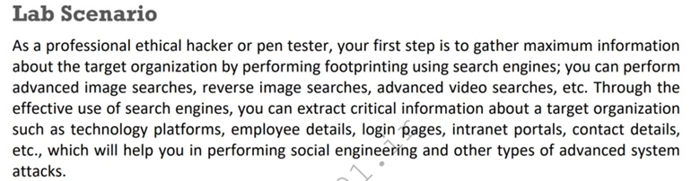{width="6.5in" height="1.6868055555555554in"}

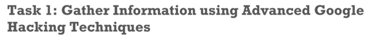{width="6.5in" height="0.6715277777777777in"}

lets go through it:

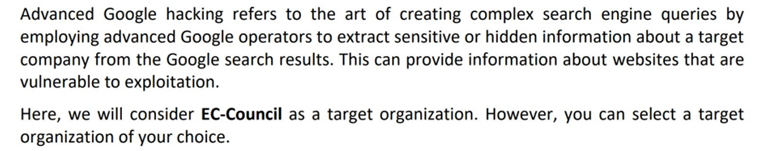{width="6.5in" height="1.2569444444444444in"}

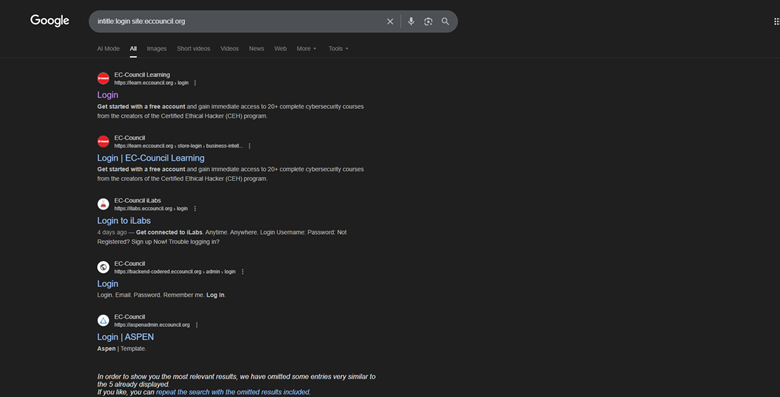{width="6.5in" height="3.3055555555555554in"}

What we did here?

This called google dorks and it means:

site:eccouncil.org → limits search results to pages on EC-Council's
official website.

intitle:login → finds pages with the word "login" in their title.

This query lists all **login portals or authentication pages** hosted on
EC-Council's domain (such as member login, exam portal login, partner
login, etc.). It's commonly used in **OSINT** or **reconnaissance** to
identify potential **entry points or login interfaces** of a specific
organization.

We can also do:

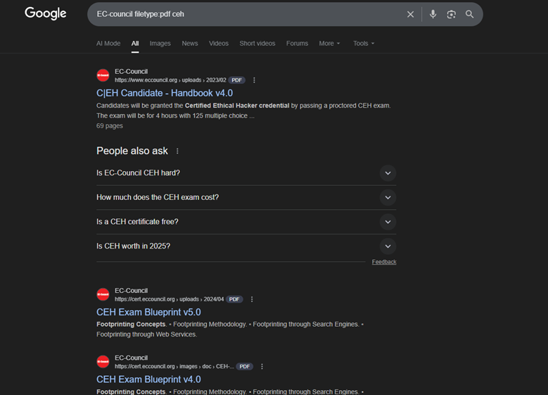{width="6.5in" height="4.678472222222222in"}

We found some pdfs here, we can us them for gathering information, they
maybe be useful and maybe not, but here we used the "filetype " to limit
the results to a specific file type.

In the end of this task I want to tell you about a great place fot
useful google dorks, GHDB.

The **Google Hacking Database (GHDB)** is a collection of carefully
crafted Google search queries---known as *Google dorks*---used by
security researchers and penetration testers to identify potential
vulnerabilities, exposed data, and misconfigurations on websites. Each
dork leverages Google's advanced search operators (like site:,
filetype:, intitle:, and inurl:) to locate specific types of
information, such as login portals, configuration files, database dumps,
or sensitive documents.

GHDB is maintained by the Exploit Database (Offensive Security) and is
widely used in **OSINT (Open Source Intelligence)** and **reconnaissance
phases** of ethical hacking. While powerful, it must always be used
**legally and ethically**, focusing on authorized testing or educational
research only.

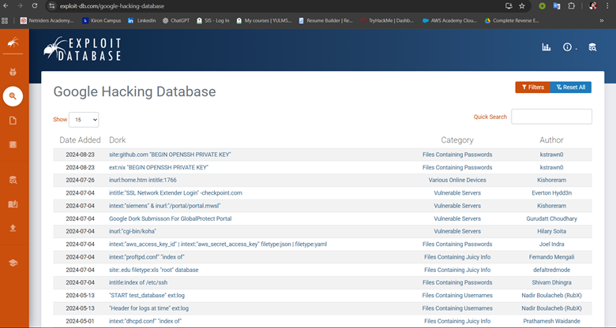{width="6.5in" height="3.4659722222222222in"}

Lab 2:

Perform footprinting through internet research services

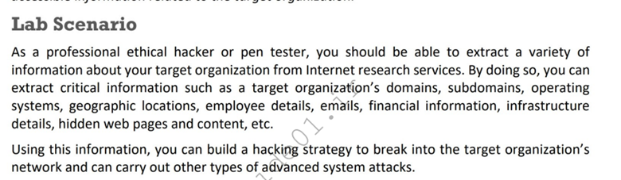{width="6.5in" height="1.8958333333333333in"}

{width="6.5in"
height="2.3604166666666666in"}

Lets go through it:

Lets start with netcarft:

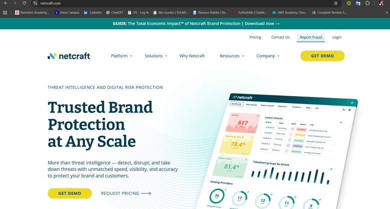{width="6.5in" height="3.4875in"}

Go to tap "Resources"

{width="6.5in"
height="1.9861111111111112in"}

Go to research tools

{width="6.5in"
height="3.185416666666667in"}

Go to site report

{width="6.5in"
height="3.1506944444444445in"}

{width="6.5in"
height="1.070138888888889in"}

I tried **https://www.netcraft.com**

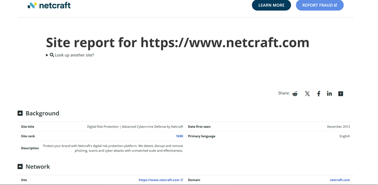{width="6.5in" height="3.1805555555555554in"}

It gave me a report for the site, lets search for subdomains,

Go to Network section:

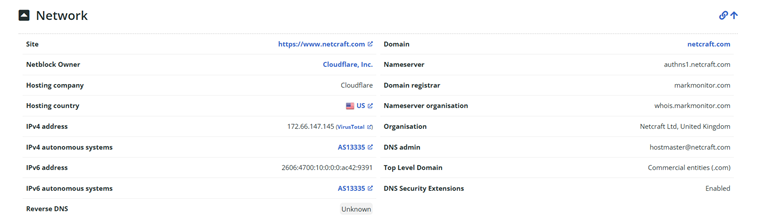{width="6.5in" height="1.8354166666666667in"}

In the domain field:

{width="6.5in"
height="2.8722222222222222in"}

It gave is 10 results containing subdomains for the site we entered.

Lets Go to dnsdumpster:

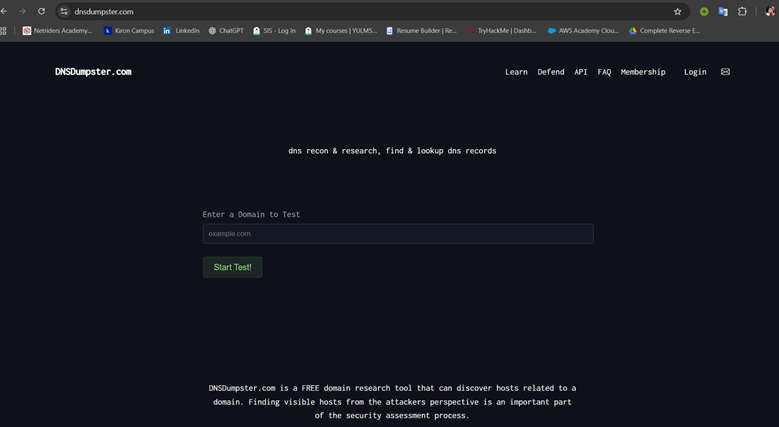{width="6.5in" height="3.561111111111111in"}

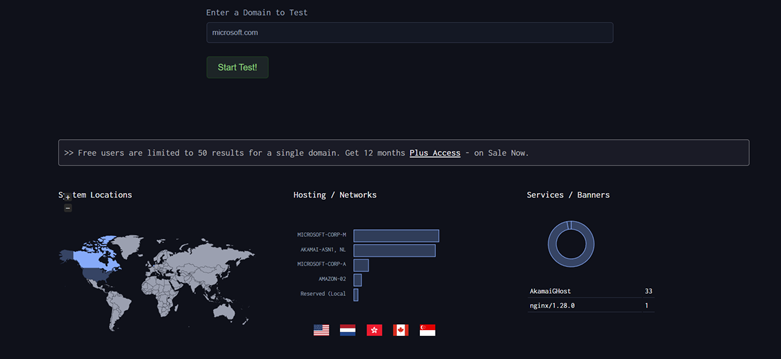{width="6.5in" height="2.997916666666667in"}

{width="6.5in"
height="3.109027777777778in"}

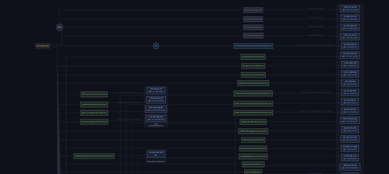{width="6.5in" height="2.910416666666667in"}

And there is a command tool called sublist3r and it's a powerful tool, I
recommend it:

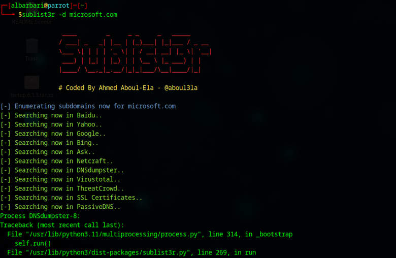{width="6.5in" height="4.23125in"}

{width="6.5in"
height="4.967361111111111in"}

Lets go to lab 3.

Lab 3:

Perform footprinting through social networking sites:

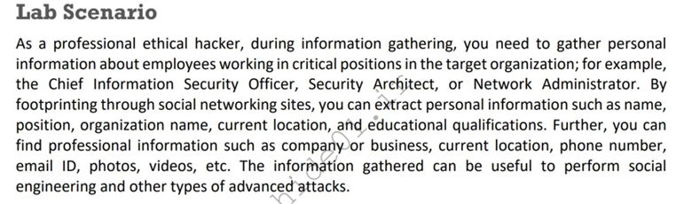{width="6.5in" height="1.9145833333333333in"}

{width="6.5in"
height="2.390972222222222in"}

**Sherlock** is an open‑source OSINT tool that enumerates a single
username across hundreds of websites and social platforms. Given a
username, Sherlock checks a large list of known sites and returns which
profiles exist (with direct links), helping investigators map a
subject's online footprint quickly and efficiently.

As u can see here:

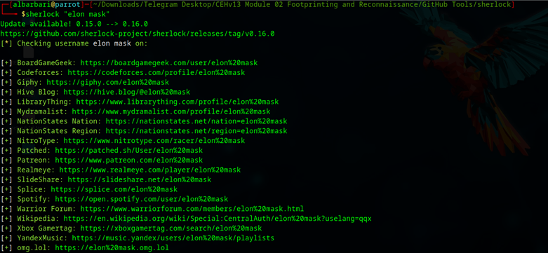{width="6.5in" height="3.0034722222222223in"}

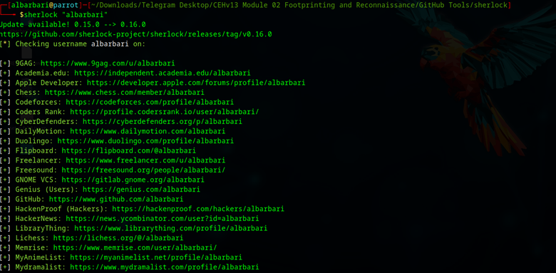{width="6.5in" height="3.1909722222222223in"}

I also tried it on myself, wow!

Lab 4:

perform whois footprinting

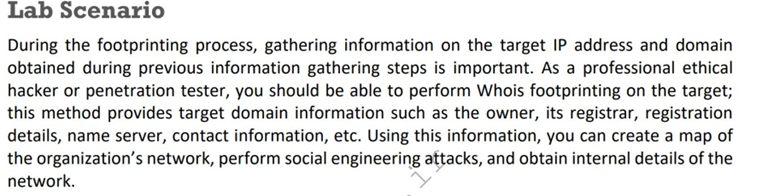{width="6.5in" height="1.6375in"}

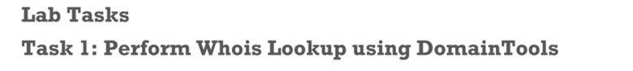{width="6.5in" height="0.7305555555555555in"}

Open the website:

{width="6.5in"
height="2.370833333333333in"}

{width="6.5in"
height="3.152083333333333in"}

**WHOIS website** are online services that allow users to query the
**public registration information** of a domain name. These platforms
provide details about domain ownership, registrar, registration and
expiration dates, name servers, and sometimes contact information
(email, phone, or address) associated with the domain.

And here is a command line tool called whois you can use:

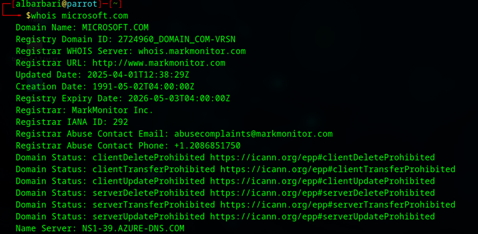{width="6.5in" height="3.1777777777777776in"}

Lab 5:

Perform DNS footprinting:

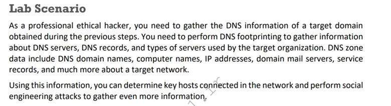{width="6.5in" height="1.773611111111111in"}

{width="6.5in"
height="2.223611111111111in"}

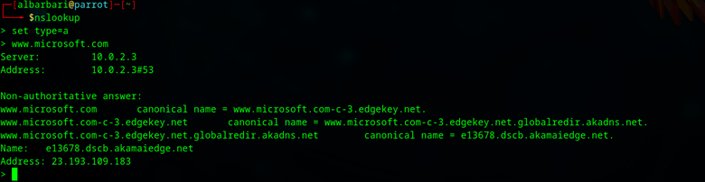{width="6.5in" height="1.6854166666666666in"}

I used nslookup to find the IP address of www.microsoft.com. The result
shows a **non-authoritative answer** because it came from a cached DNS
server. The domain has a **CNAME chain**, meaning www.microsoft.com
points to several aliases (edgekey.net, akadns.net) before resolving to
the final IP 23.193.109.183, which is part of Akamai's CDN. This shows
how Microsoft uses a **Content Delivery Network** to distribute traffic
efficiently.

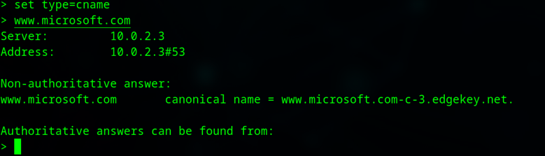{width="6.5in" height="1.8604166666666666in"}

I used nslookup to check the **CNAME record** of www.microsoft.com. The
output shows a **non-authoritative answer**, indicating that the DNS
server returned a cached response. The domain www.microsoft.com is an
**alias (CNAME)** that points to www.microsoft.com-c-3.edgekey.net. This
confirms that Microsoft uses **CNAMEs** to redirect traffic through its
**CDN infrastructure** for better performance and scalability.

Lab 6:

Perform network footprinting:

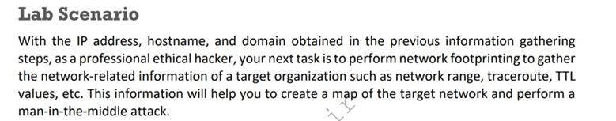{width="6.5in" height="1.273611111111111in"}

{width="6.5in"
height="1.0319444444444446in"}

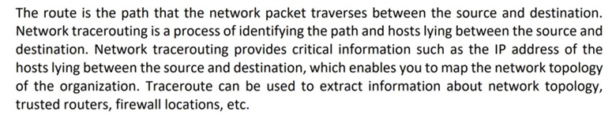{width="6.5in" height="1.2180555555555554in"}

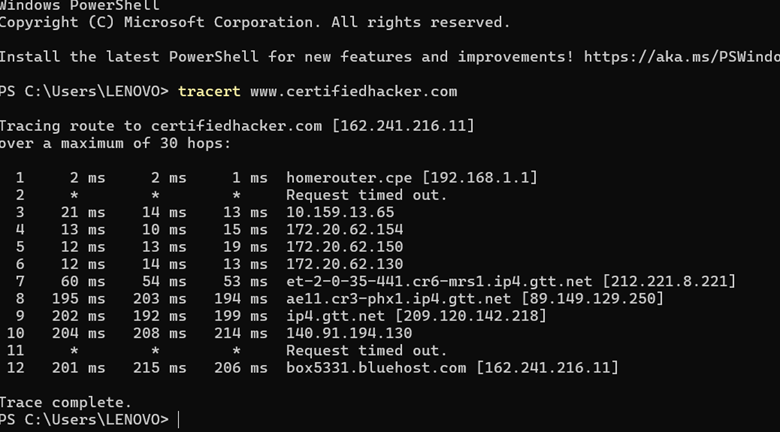{width="6.5in" height="3.6006944444444446in"}

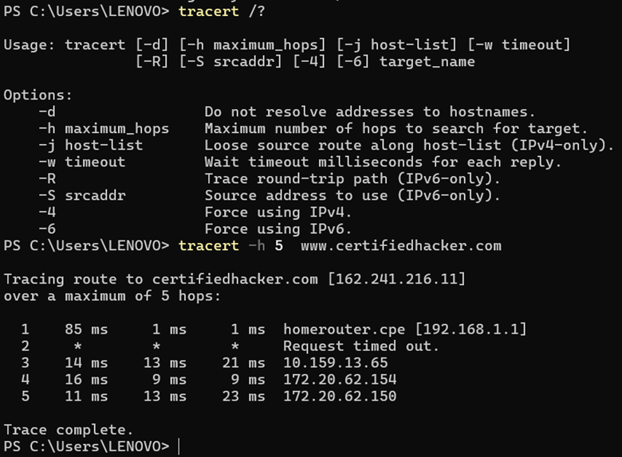{width="6.5in" height="4.779861111111111in"}

I used the **tracert** command to trace the route from my computer to
www.certifiedhacker.com. The first trace shows the full path with up to
30 hops, revealing the intermediate routers and the final destination IP
(162.241.216.11). Some hops timed out, which is common for firewalled
routers.

I also tested the **help command** (tracert /?) to see available options
and ran a limited trace (tracert -h 5) to only show the first 5 hops.
This demonstrates how tracert can be used to map the network path,
measure latency, and identify potential network segments between the
source and the target.

We can also try it on linux (parrot or kali):

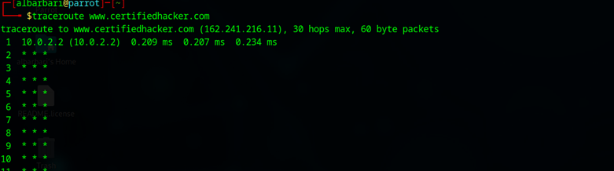{width="6.5in" height="1.8180555555555555in"}

Lab 8:

Perform footprinting using various footprinting tools:

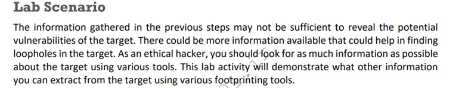{width="6.5in" height="1.24375in"}

{width="6.5in" height="1.9875in"}

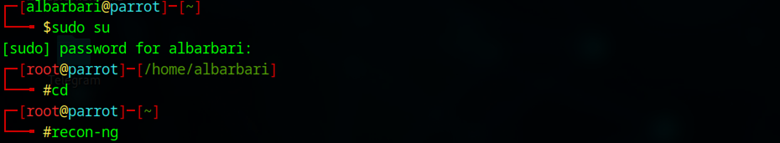{width="6.5in" height="1.195138888888889in"}

I escalated to the root user (sudo su), changed to the home directory
(cd), and launched recon‑ng.

Run help to view all the commands:

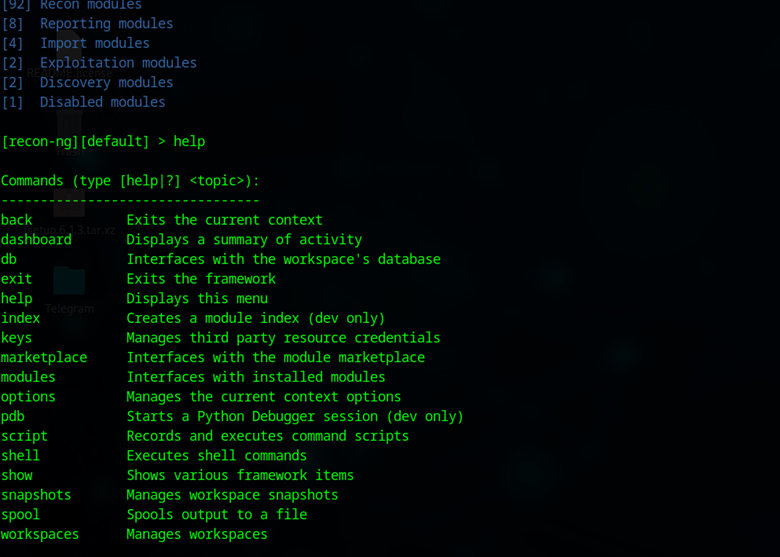{width="6.5in" height="4.6409722222222225in"}

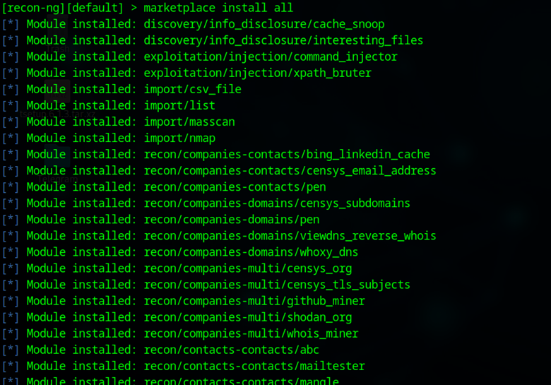{width="6.5in" height="4.535416666666666in"}

marketplace install all --- In **recon‑ng**, this command downloads and
installs **all available modules** from the recon‑ng marketplace

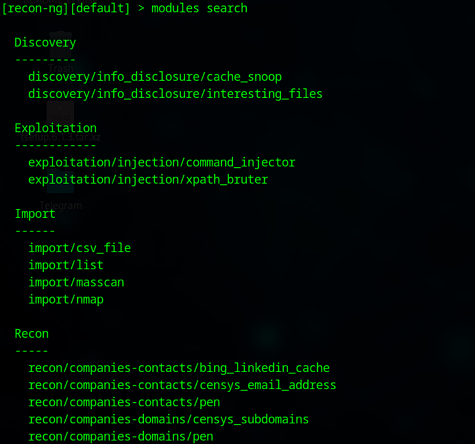{width="6.5in" height="6.0777777777777775in"}

modules search --- In **recon‑ng**, this command **lists available
modules** and allows you to **search for specific modules** by name,
category, or function.

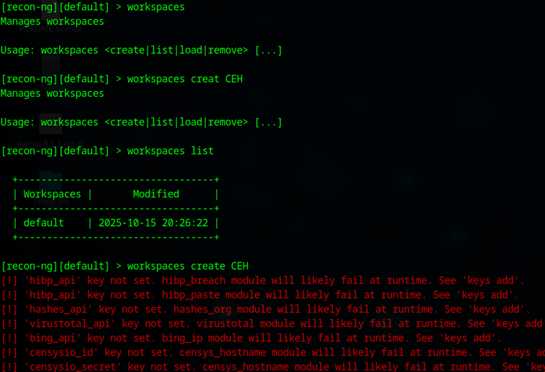{width="6.5in" height="4.438888888888889in"}

I used **workspaces** in **recon‑ng** to organize my reconnaissance
projects:

-   workspaces --- shows commands to **create, list, load, or remove**
    workspaces.

-   workspaces list --- displays existing workspaces; initially only the
    default workspace existed.

-   workspaces create CEH --- created a new workspace named **CEH** to
    separate this project's data from other recon activities.

{width="5.37575021872266in"
height="2.1461329833770777in"}

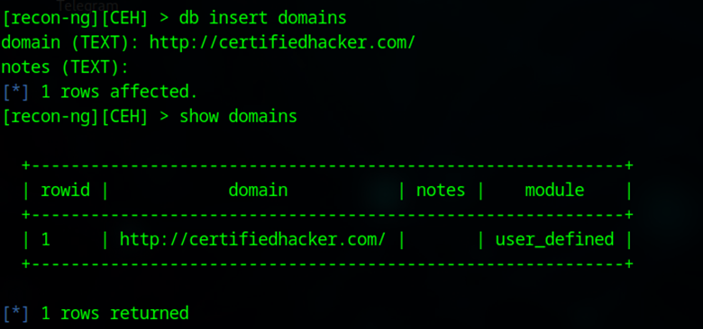{width="6.5in" height="3.053472222222222in"}

I inserted the target domain into Recon‑NG's database and verified it
was added:

-   db insert domains --- added http://certifiedhacker.com/ to the
    **domains** table (module = user_defined).

-   show domains --- displayed the domains table: one entry (rowid 1)
    with the inserted URL and no notes.

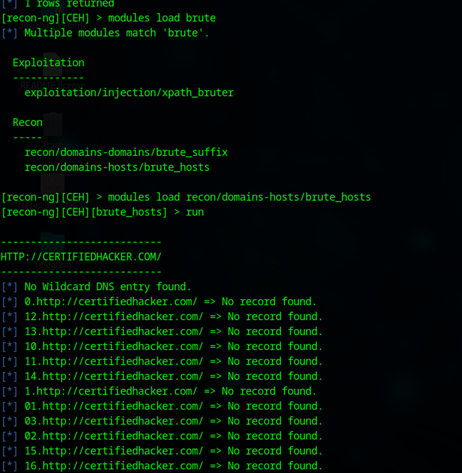{width="6.5in" height="6.659722222222222in"}

I loaded and ran a Recon‑NG brute‑force module to discover hosts:

-   modules load recon/domains-hosts/brute_hosts --- selected the
    **brute_hosts** module (a recon module that performs
    hostname/subdomain brute‑forcing against domains in the workspace).

-   run --- started the module. It tries common hostnames (from its
    default wordlist or a configured wordlist) against the target
    domain(s) stored in the **CEH** workspace and inserts discovered
    host entries (A records / resolved IPs) into the database.

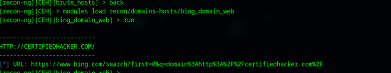{width="6.5in" height="1.225in"}

I loaded and ran the **recon/domains-hosts/bing_domain_web** module in
Recon‑NG. This module performs passive enumeration by querying Bing for
pages related to the target domain (domain:http://certifiedhacker.com/).
The module constructs a Bing search URL (shown in the output) and parses
the search results to discover hosts, subdomains, and URLs associated
with the domain. Any findings are added to the Recon‑NG database for
later review.

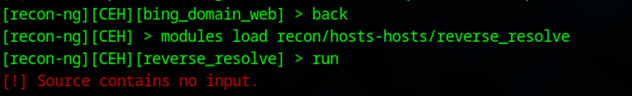{width="6.5in" height="0.9875in"} The
reverse_resolve module performs **reverse DNS lookups** on IP addresses
from a specified **source** (it maps IPs back to hostnames). The error
\"\[!\] Source contains no input.\" means the module had **no input
data** (no IPs/hosts) to process.

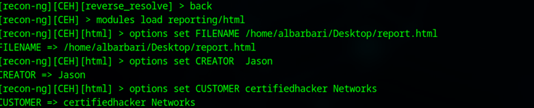{width="6.5in" height="1.3131944444444446in"}

-   modules load reporting/html --- opened the HTML report generator.

-   options set FILENAME /home/albarbari/Desktop/report.html --- set the
    output file path where the HTML report will be saved.

-   options set CREATOR Jason --- set the **Creator** field in the
    report metadata to "Jason".

-   options set CUSTOMER certifiedhacker Networks --- set the
    **Customer/Client** field in the report metadata.

**What this means:** when you run the module (run), Recon‑NG will
generate an HTML report containing data from the current **CEH**
workspace and save it to /home/albarbari/Desktop/report.html, with the
specified creator and customer fields embedded.

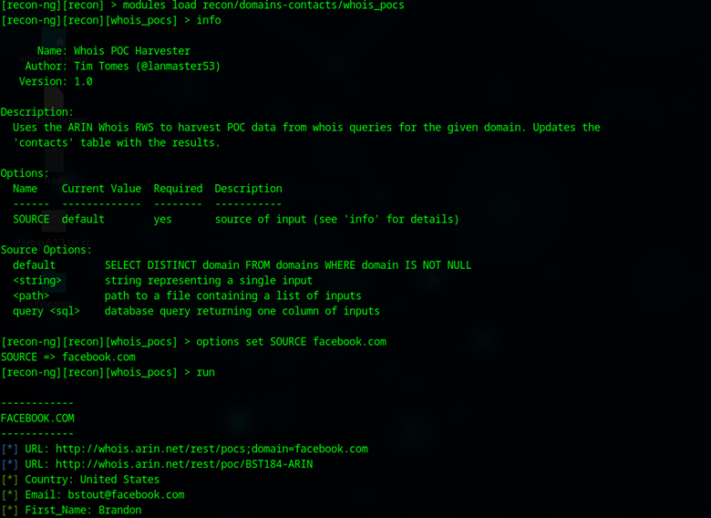{width="6.5in" height="4.731944444444444in"}

I ran the **whois_pocs** module in Recon‑NG to harvest point‑of‑contact
data from WHOIS:

-   modules load recon/domains-contacts/whois_pocs --- loaded the Whois
    POC Harvester (uses ARIN's Whois RWS).

-   options set SOURCE facebook.com --- set the input to a single domain
    (facebook.com). The module accepts a single string, file, or DB
    query as source.

-   run --- executed the module. It queried WHOIS data for the provided
    domain and populated Recon‑NG's **contacts** table with any
    discovered POC records (registrant/tech/admin contacts).

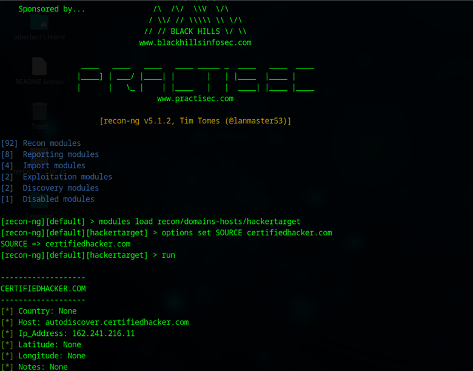{width="6.5in" height="5.102777777777778in"}

{width="6.5in"
height="5.378472222222222in"}

I ran the **recon/domains-hosts/hackertarget** module in Recon‑NG using
certifiedhacker.com as the source. The module queries the HackerTarget
service for hosts related to the domain and returns discovered hostnames
and IPs.

Output summary:

-   **Host found:** autodiscover.certifiedhacker.com

-   **IP address:** 162.241.216.11

-   **Geo fields (Country/Latitude/Longitude/Region):** no data returned

What this means: HackerTarget discovered an autodiscover subdomain for
the target and resolved it to the given IP, but did not provide
geolocation details. This is a passive, low‑noise enumeration result you
can use to expand host lists.

**1. Summary of what I did**

Performed initial footprinting to map the target's public attack surface
using passive and low‑impact methods:

-   DNS lookups (nslookup) to inspect A/CNAME records and banner
    information.

-   Path analysis (tracert) to observe network hops and latency to the
    host.

-   Recon‑NG modules: inserted domain into the CEH workspace, ran
    bing_domain_web (passive enumeration), brute_hosts (optional brute
    host discovery), hackertarget (public host discovery), and
    whois_pocs for contact harvesting.

-   Saved workspace and configured an HTML report to capture results.

Purpose: collect authoritative public information (domains, subdomains,
IPs, WHOIS) to inform further testing and to identify inadvertent
exposure of sensitive services.

**2. Key findings (concise)**

-   **Primary domain resolved:** certifiedhacker.com → IP
    **162.241.216.11** (observed via recon-ng/hackertarget and
    traceroute).

-   **Discovered host:** autodiscover.certifiedhacker.com → resolved to
    **162.241.216.11** (potential mail/autodiscover service).

-   **CNAME / CDN behavior (example):** public domains (e.g.,
    www.microsoft.com in earlier tests) resolve through CNAME chains
    into Akamai. This indicates CDN use is common for large sites ---
    follow the same best practice if CDN is used.

-   **Network path:** traceroute shows multiple transit hops and an
    endpoint hosted on a shared hosting / provider (bluehost in
    example). Intermediate hops may be firewalled (some timeouts).

-   **WHOIS / POC exposure:** WHOIS harvesting can reveal contact
    records (when not privacy‑protected). Some domains return
    privacy‑protected or no contact fields.

**3. Risks identified (what these findings imply)**

-   **Exposure of internal or service hostnames** (e.g.,
    autodiscover.\*) can reveal email/autoconfiguration infrastructure
    useful to attackers (phishing, targeted mail service attacks).

-   **Publicly resolvable service records** (MX, A, autodiscover) expand
    the attack surface for phishing, credential stuffing, or targeted
    exploitation.

-   **WHOIS POC data** can expose email addresses/contacts that can be
    abused for social‑engineering or spam if not protected.

-   **Brute‑force / enumeration noise** --- while not necessarily a risk
    to the target, aggressive probing can trigger alerts or violate
    acceptable‑use; improper scanning can be logged and escalated.

**4. Recommendations --- how to reduce these risks**

Prioritize practical controls (technical + process) to minimize
information leakage and reduce attacker utility of public data.

**DNS & Hosting**

-   **Use least‑privilege DNS records:** remove or hide unnecessary
    records (especially internal- or service-specific hostnames like
    autodiscover.\*) from public DNS when possible.

-   **Use a CDN / reverse proxy** (if appropriate) to mask origin
    servers and absorb traffic; configure CNAMEs and origin shielding
    correctly.

-   **Disable open zone transfers (AXFR)** on authoritative name servers
    --- allow them only to authorized secondaries.

-   **Limit public exposure of SRV/CNAME records** that reveal internal
    services. Replace sensitive hostnames with generic fronting names if
    feasible.
